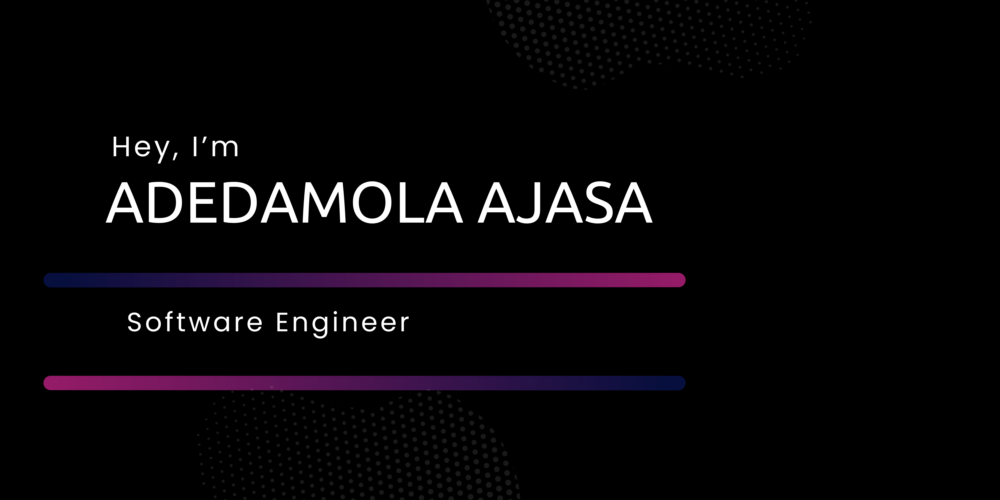

# 👋 Hey, I'm Damoxify!

I'm a software engineer with a focus on backend web development, specializing in Flask and PostgreSQL. While my expertise lies in crafting robust server-side solutions, I'm currently exploring the exciting world of frontend development, using React to build user-friendly and visually appealing web applications. My mission is to make the technology industry more accessible to aspiring developers and engineers by sharing the mistakes I've made and the lessons I've learned throughout my software engineering journey.

## 🚀 What I Do

- **Backend Web Development:** Flask and PostgreSQL.
- **Frontend Development:** Enthusiastic about building user-friendly interfaces using React.
- **Other Technologies:** Proficient in Node.js, Python, and Click.
- **Styling:** Tailwind CSS for creating responsive and attractive designs.

## 🌐 Let's Connect!

## 🎉 Fun Facts

- 🐍 The first language I used to program "Hello World" was Python.
- 📰 I've always loved staying updated on news and current happenings.
- 🎬 I'm an anime enthusiast and have recently started reading some cool manga. My current favorite this year is *Hell's Paradise*.
- ⚽ My favorite sport is football/soccer, and the current club I support is Manchester United.
- 🎮 If I'm not coding or watching the news, you'll likely find me playing a video game. My all-time favorite game is *"Halo 5"*.

## 🔨 My Current Tech Stack

## 📈 GitHub Stats

## 🖋️ Currently Learning

- **Python:** Mastering the art of building robust APIs using Python.
- **JavaScript:**  Exploring the process of building npm packages.

## 43
### Let's Get Social
Follow me around the web!

Thanks for stopping by! Feel free to explore my repositories and connect with me. Let's build something awesome together!
